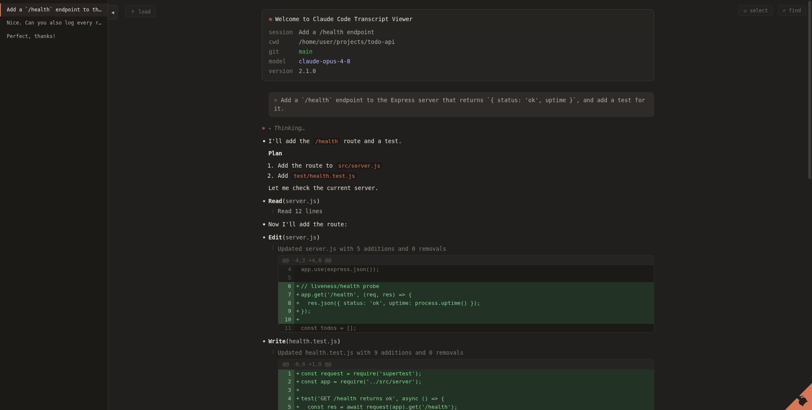

# Claude Code Transcript Viewer

A zero-dependency web UI that renders **Claude Code** `.jsonl` session transcripts
with Claude Code's own look and feel — same dark palette, monospace layout, `⏺`
message bullets, `⎿` tool-result connectors, `✻ Thinking…` blocks, and inline
diffs — **without** the statusline or the input prompt box.

**▶ Live demo:** <https://ly4096x.github.io/ClaudeCodeTranscriptViewer/> — loads a
bundled sample; drag-and-drop your own `.jsonl` to view it (everything stays in
your browser).



## Features

- 🎨 **Faithful Claude Code look** — dark warm palette, monospace layout, `⏺` bullets, `⎿` connectors; no statusline, no input box.
- 📂 **Load anything** — pass a `.jsonl` on the command line or drag-and-drop it in the browser. Zero runtime dependencies.
- 🧠 **Collapsible thinking** — `✻ Thinking…` blocks fold away by default.
- 🔧 **Rich tool rendering** — full (multi-line) Bash commands, `Read`/`Glob`/`Grep`, and **green/red unified diffs** for `Edit`/`Write`, with ANSI-stripped output.
- 🗂️ **Folded by default** — skill content, post-compact summaries, and background-task notifications collapse to a one-line summary you can expand.
- ✅ **More message types** — TodoWrite checklists, slash commands, images, and Markdown (code, tables, lists, links).
- 📑 **Prompt sidebar** — indexes only the prompts *you* typed; click to jump, auto-highlights the current one while scrolling, and is **resizable** + **foldable**.
- 🔍 **Full-transcript search** — `Ctrl/Cmd-F`, **regex** (`.*`), **case-sensitive** (`Aa`), and **per-kind scopes** (prompt / answer / tool / thinking / summary / skill / system). The current match glows **bright yellow**, and collapsed blocks auto-expand when you land on a hit.
- ☑️ **Selective mode** — click **☑ select**, tick any items (clicking anywhere on an item toggles it), then **show selected** to filter the view down to just those items; **edit selection** or exit back to the full transcript anytime.
- ⚡ **Scales** — incremental "Load more" rendering handles huge transcripts (40 MB+) and indexes thousands of search matches in well under a second.
- 🔒 **Safe & local** — all transcript text is escaped before formatting (no markup injection), and the server binds `127.0.0.1` by default.

## Requirements

- Node.js ≥ 18 (no runtime dependencies for the viewer itself)
- [pnpm](https://pnpm.io) — only for installing the Playwright test library.
  `pnpm-workspace.yaml` sets `minimumReleaseAge: 10080` (7 days), so freshly
  published dependency versions soak for a week before they can be installed.

## Usage

### Load a transcript from the command line

```bash
node server.js demo/demo-session.jsonl          # try the bundled demo
# or your own:
node server.js --file path/to/session.jsonl --port 5757
```

Then open <http://localhost:5757>. The transcript is loaded and rendered
automatically. The server binds `127.0.0.1` by default; pass `--host 0.0.0.0`
to expose it on your network.

### Load a transcript by uploading in the browser

```bash
node server.js
```

Open the page and **drag-and-drop** a `.jsonl` file (or click to choose one).
No server-side file is required for this path — parsing happens in the browser.

### Where are my transcripts?

Claude Code stores per-project session transcripts under:

```
~/.claude/projects/<encoded-project-path>/<session-id>.jsonl
```

## What it renders

| Transcript content            | Rendering                                                    |
| ----------------------------- | ----------------------------------------------------------- |
| Session metadata              | A Claude Code-style "Welcome" box (cwd, git, model, version)      |
| User prompts / slash commands | `> prompt` / `> /command`, in a gray bubble                      |
| Assistant text                | Markdown (headings, lists, code, tables, links)                  |
| Thinking blocks               | Collapsible `✻ Thinking…`                                        |
| Tool calls                    | `⏺ Tool(args)` (small bullet) with a `⎿` result block            |
| Bash                          | Full command (multi-line preserved) + ANSI-stripped output       |
| Edit / Write                  | Green/red unified diff with line numbers                         |
| TodoWrite                     | `☐ / ☒` checklist                                                |
| Skill content                 | Folded by default (`▸ Skill content · name`), expand to read     |
| Background task notifications | Compact `▸ Background task <status> — <summary>`, expand for raw  |
| Images                        | Inline ``                                                   |

Long outputs are clamped with a "… +N lines (click to expand)" toggle, and very
large transcripts render incrementally via a "Load more" control (auto-loads on
scroll).

### Prompt sidebar

A left sidebar indexes every prompt **user** typed (auto-fed messages — skill
content, task notifications, continuation summaries, tool results, slash
commands — are excluded). Click an entry to jump to that prompt; as you scroll,
the entry for the current/most-recent prompt is highlighted and scrolled into
view. The sidebar is **resizable** (drag its right edge) and **foldable** (the
arrow flag at its top edge).

### Search

Press **Ctrl+F / Cmd+F** (or click the **⌕ find** button) to search the whole
transcript — including content in not-yet-rendered batches and inside collapsed
thinking / folded blocks (which auto-expand when you land on a match). The
current match is highlighted in **bright yellow**; **Enter / Shift+Enter** (or
↑/↓) step through matches, the count shows `current/total`, and navigating to a
deep match renders the batches up to it. **Esc** closes the bar.

Find-bar toggles: **`Aa`** case-sensitive, **`.*`** regular expression
(invalid patterns are flagged, not thrown), and a per-kind scope row —
**prompt / answer / tool** (on by default) and **thinking / summary / skill /
system** (off by default) — so you choose exactly which content to search. (On
the bundled 42 MB sample, search indexes thousands of matches in well under a
second.)

### Selective mode

Click **☑ select** to start picking: a themed checkbox appears before every
item, and clicking anywhere on an item toggles it (folds/links are suspended
while picking). The top bar tracks the count, with **all** / **none**
shortcuts. **show selected** filters the transcript down to just the checked
items — checkboxes disappear, and the sidebar and search follow the filtered
view. From there, **edit selection** returns to picking (checks preserved), and
**✕** (or **☑ select** again) restores the normal full view.

## Project layout

```
server.js             zero-dependency static server + --file CLI / upload API
public/index.html     markup (landing/upload + transcript view)
public/styles.css     Claude Code dark-theme palette & layout
public/app.js         JSONL parsing + Claude Code-style renderer
demo/                 a crafted English demo transcript (used for the screenshot)
docs/screenshot.png   the README screenshot
pnpm-workspace.yaml   pnpm settings (7-day dependency soak time)
tests/verify.mjs      Playwright (real, non-headless browser) verification
tests/robustness.mjs  Playwright pass over several real transcripts
```

## Verification (Playwright, real non-headless browser)

The test scripts launch a **real, non-headless** Chromium and assert the layout
and behavior, saving screenshots to `tests/screenshots/`.

```bash
pnpm install                # installs the playwright library

# The scripts (tests/launch.mjs) use $CHROMIUM_BIN as Playwright's executablePath.
# Provide a real browser one of two ways:

# (a) A real, maximized window on your desktop. On a Wayland desktop it runs as a
#     native Wayland client (no Xwayland):
source tests/desktop-env.sh            # auto-detects brave/chromium + the Wayland session

# (b) Headless host with no desktop — Xvfb + a system Chromium:
#   export CHROMIUM_BIN=$(command -v chromium)
#   Xvfb :99 -screen 0 1280x1600x24 & export DISPLAY=:99

node server.js sample/sample-session.jsonl --port 5858 --host 127.0.0.1 &  # start the viewer
BASE_URL=http://127.0.0.1:5858 node tests/verify.mjs   # 21 layout/behavior checks
```

Other suites: `tests/check_search.mjs` (search), `tests/check_sidebar.mjs`
(prompt sidebar), `tests/check_select.mjs` (selective mode),
`tests/check_layout.mjs` (floating controls + GitHub corner),
`tests/check_fixes.mjs`, `tests/robustness.mjs` (many real transcripts). All
honor `BASE_URL` / `CHROMIUM_BIN` / `DISPLAY`.

`tests/verify.mjs` checks, among other things: server auto-load, all message
types render, **no chat input box and no bottom statusline**, the dark palette
and Claude brand orange (`#d97757`), thinking expand/collapse, diff rendering,
"Load more" pagination, and the upload path.

## Design notes

- **No statusline, no input prompt box** — by request. The only chrome is the
  faint "＋ load" button (top-left, beside the sidebar), the top-right
  "☑ select" / "⌕ find" buttons with their bars (the search field is a find
  box, not a chat prompt), and the GitHub corner at the bottom-right.
- The viewer escapes all transcript text before formatting, so transcript
  content cannot inject markup.
